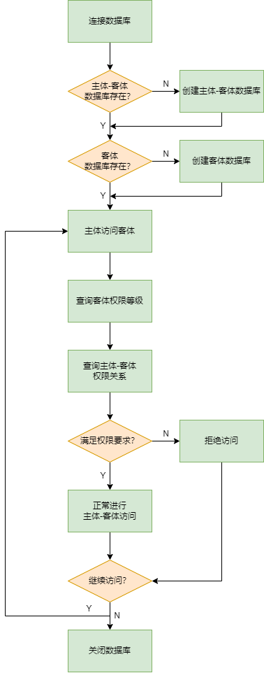

# 使用进程控制sqlite数据库
## 基本功能
- `sqlite3_open(const char *filename, sqlite3 **ppDb)`
  - 创建并连接数据库
- `sqlite3_exec(sqlite3*, const char *sql, sqlite_callback, void *data, char **errmsg)`
  - 执行相应的sql命令
- `sqlite3_close(sqlite3*)`
  - 关闭之前连接的数据库

## 数据库设计
- 我们通过设计若干个数据库，分别存储用户权限等级、文件等级、I/O设备等级、进程等级等数据库
### 用户-文件权限等级数据库
- 该数据库存储用户读写文件相关的等级
- 当用户需要对某个文件进行访问等相关操作时，需要将该权限等级与文件等级进行比较，满足要求才可以进行相应的操作

### 文件权限等级数据库
- 记录每个文件的访问等级

### 其他数据库
- 与之类似，同时设计用户-进程数据库、用户-I/O设备数据库、用户-网络数据库
- 与之相对应，设计进程等级数据库、I/O设备等级数据库、网络等级数据库，记录该项目对应的权限等级

## 数据库访问控制
- 只有root用户才可以访问、修改该类数据库，其他用户不可修改该数据库

## 访问控制流程图
- 